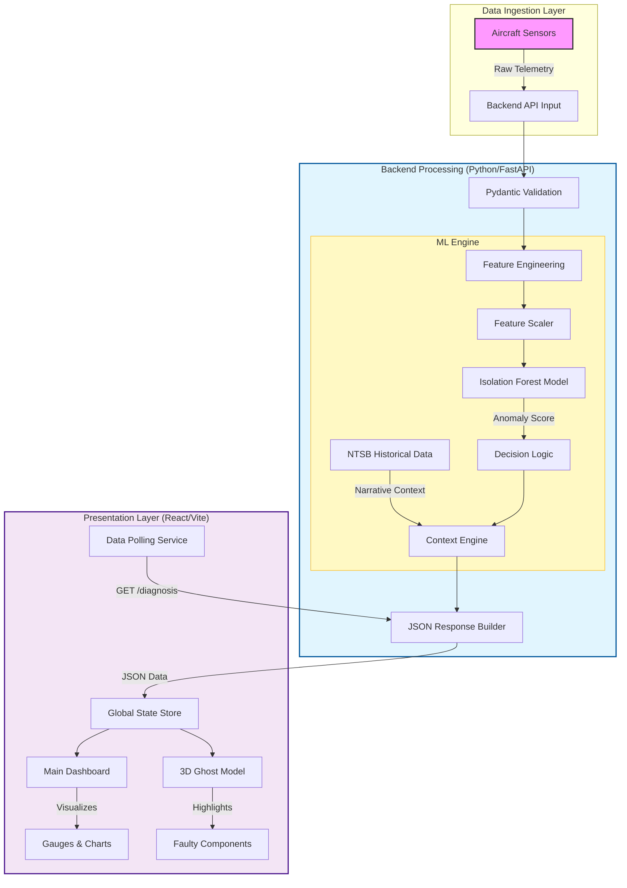

# AeroGuard System Architecture

This document outlines the data flow and architectural components of the AeroGuard system.

## Data Flow Description

1.  **Ingestion**: Telemetry data (LATP, VEL, EGT, etc.) is received from the aircraft sensors (or simulation).
2.  **Processing**:
    *   **Validation**: `server_ml.py` ensures data integrity using Pydantic models.
    *   **ML Analysis**: Data is scaled and passed to the **Isolation Forest** to detect anomalies.
    *   **DQI Check**: Data Quality Index validates sensor reliability (detecting frozen/erroneous sensors).
3.  **Visualization**:
    *   The **React Frontend** polls the backend every 2 seconds.
    *   **Dashboard**: Displays real-time metrics (EGT, Vibration, Hydraulic Pressure).
    *   **3D Engine**: The Ghost Model highlights specific engine components in **Red/Yellow** based on the ML diagnosis.
